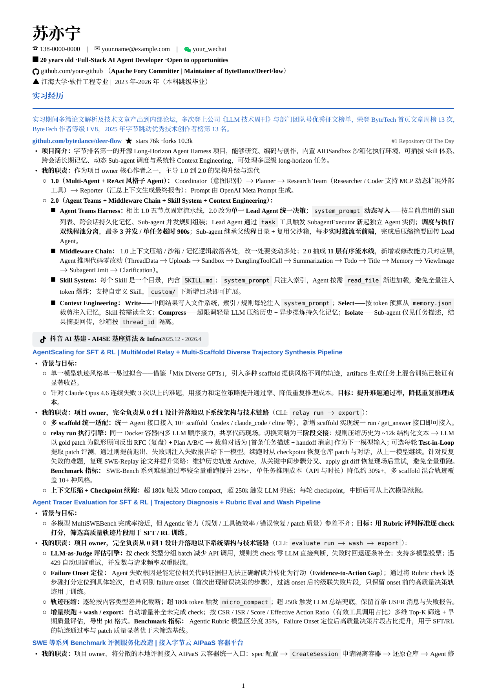
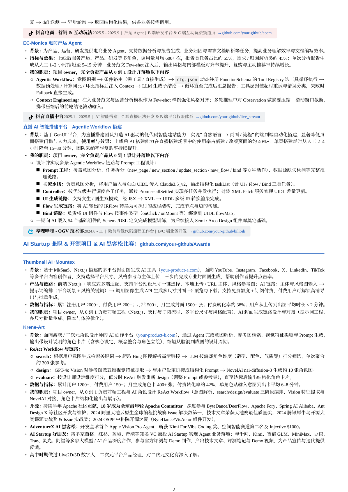

# resume-forge — 一份强技术简历 + 把"写好简历"蒸馏成的 Skill

开源两样东西：
1. **`resume/`** — 一份 1:1 精排的中文技术简历 LaTeX 模板（脱敏/虚构信息版，含真公司 logo、超链接、配色）。
2. **`resume-forge/`** — 一个 Claude Code **Skill**：把你手上**任意来源、任意模板**的简历内容，迁移进这套精排模板里，**调好排版**，并按这套模板的写法把内容写得**清晰明了**（附带润色与脱敏）。

## 效果预览

<p align="center">
  
  
</p>

> 上图为 `resume/resume_template.pdf` 的渲染效果(虚构信息版)。

## 快速上手（用简历模板）
```bash
cd resume/
# 改 resume_template.tex 顶部 8 个 \newcommand 填你的信息(姓名/电话/邮箱/微信/GitHub/学校/域名)
tectonic resume_template.tex          # 或 xelatex
```
- 加公司 logo：正文写 `\logo{bytedance}`；素材库在 `assets/logos/`（23 个，见 `resume-forge/references/logo_index.pdf`）。
- 缺的公司：`python3 resume-forge/scripts/fetch_logos.py 公司slug`。

## 用 Skill（Claude Code）
把 `resume-forge/` 放进 `~/.claude/skills/`（或作为 plugin）。之后对 Claude 说：
- "把我这份简历（任意格式/模板）适配进这个模板 / 1:1 复刻 / 脱敏" → 走**内容迁移 + 排版调优**流程。
- "润色我的简历" → 按 `resume-forge/PRINCIPLES.md`（强简历十条原则）改，**只改措辞不动事实**。

## 内容
- `resume-forge/SKILL.md` — 三种用法工作流 + 1:1 保真清单 + 环境坑。
- `resume-forge/PRINCIPLES.md` — 从一份顶尖简历蒸馏的写法原则（量化/owner化/机制化/命名概念/去水分…）。
- `resume-forge/template/` — 模板 + logo 素材库（pdf 矢量 + svg 源）。
- `resume-forge/scripts/` — 抽取 / 取 logo / 编译。

## 依赖
XeLaTeX（推荐 tectonic，自带自动装包）+ 字体 `Noto Serif CJK SC` / `Liberation Serif` / `DejaVu Sans Mono`。
取 logo 需 `cairosvg`（`python -m venv` 装，系统需 `libcairo`）。

## 许可 / 素材来源
公司 logo 来自 [Simple Icons](https://simpleicons.org)（品牌商标，仅用于简历标注真实经历 / nominative use）。
